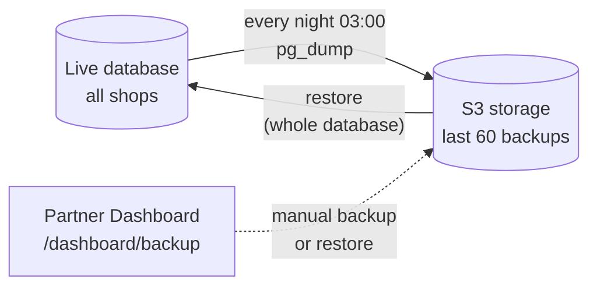

# custom-shafts

## 1. Catalogue page

The page is good: clear, easy to use, and everything the shop needs is on one screen.

## 2. Popup: how production starts

With **3D-Modell hochladen** the popup is easy: one click and the order form opens.

With **Physischer Leisten** the popup keeps going and asks for the shipping of the last (combined shipment, label, pickup, date, address) before the shop even sees the order. This is the wrong place. The shipping choice should move into the order page itself, for example as a sidebar, so the popup only asks how production starts.

In my opinion, this needs to be a bit easier.

## 3. Order form

The choice "physical last or 3D" is made in the popup and cannot be changed here. If the shop changes its mind, it has to go back and start again. We suggest letting the shop switch between physical last and 3D directly on this page.

Shipping should also be managed from this page, not at the start. While **Show prices** is off (during the customer consultation), the shipping part stays hidden. The shop can open the order again later and edit the shipping there.

This step can feel complicated for a normal partner. We suggest making it simpler.

## 4. Balance page: activity

The page itself is fine. But the logic behind it was built for transactions, and today it is used to track orders. We suggest rebuilding it around the order:

- Clicking an order opens its details.
- The shop can edit an order until the admin confirms it.
- Shipping is managed in a sidebar: cancel a FedEx label, add or remove a shipment group.

These changes can be added easily.

**Drafts cannot be deleted**

A shop can cancel an order only after it is sent ("Order received"). A draft has no delete option, so drafts the shop does not need stay in the list. We suggest letting the shop delete its own drafts, and restore them later if needed, the same way the admin can restore orders from the Trash.

Personally, I do not like the design of this page. We need to improve its UI/UX.

## 5. Database backup

**How it works**

|                           |                                                                                                                   |
| ------------------------- | ----------------------------------------------------------------------------------------------------------------- |
| When                      | Every day at 03:00 morning in Germany time                                                                        |
| How                       | `pg_dump` of the whole database, uploaded to S3                                                                   |
| Kept                      | The last 60 backups (about 2 months)                                                                              |
| Manual backup and restore | Partner Dashboard, `/dashboard/backup`. A restore first takes a safety snapshot, then replaces the live database. |

**Risk**

- If a backup fails, there is no notification. Nobody learns about it.
- The whole day's work is backed up once, at 03:00 at night. For example: a shop creates a draft order and deletes it one hour later. That order cannot be recovered, because it never reached a backup.
- Data older than 60 days can no longer be restored.
