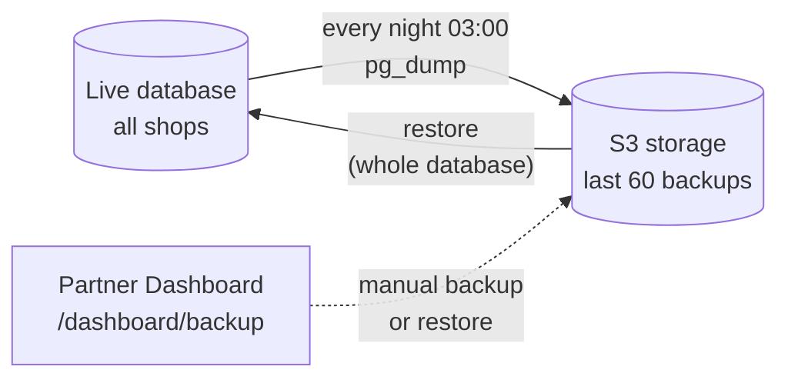

# custom-shafts

<<<<<<< HEAD
| Chapter | Topic                                | Route                                                   |
| ------- | ------------------------------------ | ------------------------------------------------------- |
| 1       | Clinical Assistant (Masschuhauftrag) | `/dashboard/scanning-data/[id]?form=clinical_assistant` |
| 2       | Custom shafts                        | `/dashboard/custom-shafts`                              |

---

# Chapter 1: Clinical Assistant (Masschuhauftrag)

This is the page where the shop builds a custom shoe order for one customer, step by step: Befund, Versorgungsplan, Leisten, Bettung, Schaft, Boden, Halbprobe, Auftrag and Abholung.

The main issue on this page is state management. Because of the many regular updates, the page often shows old or wrong data until it is reloaded, and the flow between the steps breaks. We need to improve the state management in the code first, and then the UI.

**What we use now:** only React `useState` and `useEffect` inside one very large component.

**What would be better:** TanStack Query for server data (cache per order, auto update after save) and Zustand for the page state (one store for the order).
## 1.1 Overview

The flow is good, but the customer header shows dashes instead of real data, and the two progress numbers do not match ("1 von 2" here, "0 von 4" in Konfiguratoren). There are also too many buttons, so the next step is not clear.

## 1.2 Konfiguratoren

The cards are too small for the data they show (status, icons, employee, warnings, production type). We suggest a full-width list in the real workflow order: Leisten → Halbprobe → Schaft/Boden → Auftrag → Abholung.

## 1.3 Leisten konfigurieren

The UI here is fine. The work is in the code: we need better state management, so the data in the drawer always matches the order.

## 1.4 Halbprobe and feedback

We need to improve the UI of this modal, so the feedback is clearer and easier to read.

## 1.5 State management

The page does not handle state well. Draft data (by customer) and order data (by order) are loaded in two different ways, and the page often shows old data until reload. This is why the flow breaks after regular updates. We suggest one store for the order and letting the backend decide which steps are allowed.

---

# Chapter 2: Custom shafts

## 2.1 Catalogue page
=======
## 1. Catalogue page
>>>>>>> 04c895fef243b168549cd1ac1dbab2d7bf1f4e5f

The page is good: clear, easy to use, and everything the shop needs is on one screen.

## 2. Popup: how production starts

With **3D-Modell hochladen** the popup is easy: one click and the order form opens.

With **Physischer Leisten** the popup keeps going and asks for the shipping of the last (combined shipment, label, pickup, date, address) before the shop even sees the order. This is the wrong place. The shipping choice should move into the order page itself, for example as a sidebar, so the popup only asks how production starts.

In my opinion, this needs to be a bit easier.

## 3. Order form

The choice "physical last or 3D" is made in the popup and cannot be changed here. If the shop changes its mind, it has to go back and start again. We suggest letting the shop switch between physical last and 3D directly on this page.

Shipping should also be managed from this page, not at the start. While **Show prices** is off (during the customer consultation), the shipping part stays hidden. The shop can open the order again later and edit the shipping there.

This step can feel complicated for a normal partner. We suggest making it simpler.

## 4. Balance page: activity

The page itself is fine. But the logic behind it was built for transactions, and today it is used to track orders. We suggest rebuilding it around the order:

- Clicking an order opens its details.
- The shop can edit an order until the admin confirms it.
- Shipping is managed in a sidebar: cancel a FedEx label, add or remove a shipment group.

These changes can be added easily.

**Drafts cannot be deleted**

A shop can cancel an order only after it is sent ("Order received"). A draft has no delete option, so drafts the shop does not need stay in the list. We suggest letting the shop delete its own drafts, and restore them later if needed, the same way the admin can restore orders from the Trash.

Personally, I do not like the design of this page. We need to improve its UI/UX.

## 5. Database backup

**How it works**
image.png
| | |
| ------------------------- | ----------------------------------------------------------------------------------------------------------------- |
| When | Every day at 03:00 morning in Germany time |
| How | `pg_dump` of the whole database, uploaded to S3 |
| Kept | The last 60 backups (about 2 months) |
| Manual backup and restore | Partner Dashboard, `/dashboard/backup`. A restore first takes a safety snapshot, then replaces the live database. |

**Risk**

- If a backup fails, there is no notification. Nobody learns about it.
- The whole day's work is backed up once, at 03:00 at night. For example: a shop creates a draft order and deletes it one hour later. That order cannot be recovered, because it never reached a backup.
- Data older than 60 days can no longer be restored.

## 6. Clinical order page: Configurators

**Problems**

| #   | Problem                                                                                 | Where                                                                                      |
| --- | --------------------------------------------------------------------------------------- | ------------------------------------------------------------------------------------------ |
| 1   | `getOrderComponents` is called from 9 places, once per part and again after every save  | `components/clinical/ComponentConfigurator.tsx` (lines 733–1078)                           |
| 2   | Leisten form is read every 400 ms while open                                            | `ComponentConfigurator.tsx:1232` (`setInterval(tick, 400)`)                                |
| 3   | Three files with more than 3000 lines each                                              | `ComponentConfigurator.tsx` (3294), `CarePlan.tsx` (3083), `ClinicalAssistant.tsx` (3837)  |
| 4   | No chat with FeetF1rst on External cards; the shop must open the Balance page           | `ComponentConfigurator.tsx`                                                                |
| 5   | Live update (`shoe-order-steps`) is sent only from the QR / barcode link                | backend `order_sheet.controllers.ts:105`                                                   |
| 6   | On a live update, only the step list reloads, not the cards                             | `CarePlan.tsx:698`                                                                         |
| 7   | Saving a part confirms the whole order (`order_conform`) without the signature buttons  | backend `order_components.controllers.ts:1633` (`markShoeOrderConform`)                    |
| 8   | No unique rule for one part per order, so a double click can create the same part twice | schema `clinica_assistant_order_components` (no `@@unique([shoe_order_id, catagory])`)     |
| 9   | Same for active parts: duplicate rows possible                                          | schema `active_components` (no `@@unique([shoe_order_id, catagory])`)                      |
| 10  | Internal / External is saved in 2 tables that can disagree                              | `clinica_assistant_order_components.component_type` and `active_components.component_type` |

### 6.1 "Entwurf gespeichert" popup

- "Draft" only means "order not confirmed". Parts are not checked, so a supply with a running FeetF1rst order is still called a draft.
- **"Nein, löschen" deletes the whole supply** (findings, signature, insurance, notes, history and more). No undo, no trash. A running FeetF1rst order is not cancelled, only unlinked.
- Confusing buttons: question "keep?", red button "No, delete".
- Not shown on tab close or reload. If the check fails, the page just leaves.
